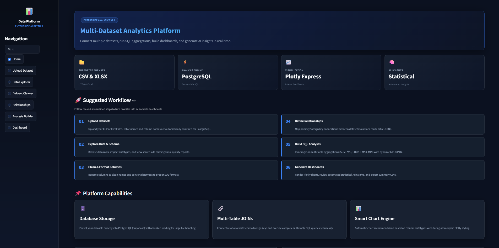

# 📊 Data Analytics Platform

[](https://www.python.org/)


A full-stack data analytics platform built with **Python, Streamlit, PostgreSQL, SQLAlchemy, Pandas, NumPy, Plotly, and custom CSS**.

The platform allows users to upload datasets, explore schemas, clean columns, define relationships between datasets, perform dynamic SQL-based analysis, build interactive dashboards, and generate automated statistical insights.

---

## 🖥️ Application Preview



---

##  🌐 Live Demo :

🔗 Link - https://dataset-insight-platform.streamlit.app/

---

## 🚀 Features

### 📤 Dataset Upload

- Upload CSV datasets
- Upload Excel (XLSX) datasets
- Automatic PostgreSQL cloud storage
- Safe column and table formatting

---

### 🔍 Data Explorer

- Browse uploaded datasets
- Preview rows and columns
- View datatypes
- Explore schema dynamically

---

### 🧹 Dataset Cleaner

- Fix column names
- Convert datatypes
- Save cleaned datasets back to database

---

### 🔗 Relationship Builder

- Create relationships between datasets
- Multi-table support
- Relationship management system
- Dynamic JOIN handling

---

### 📊 Dynamic Analysis Builder

- Single table analysis
- Multi-table analysis
- SQL query generation
- Aggregations:
  - SUM
  - AVG
  - COUNT
  - MAX
  - MIN

---

### 📈 Dashboard Builder

- Dynamic dashboard generation
- Smart chart recommendation engine
- Interactive Plotly visualizations
- Multi-dataset dashboards

Supported charts:

- Bar Chart
- Line Chart
- Pie Chart
- Scatter Plot

---

### 🧠 AI Insight Engine

- Auto-generated insights
- Trend summaries
- Dataset observations

---

### 📋 Data Quality Reports

- Missing value detection
- Duplicate checks
- Dataset health summary

---

## ⚠️ Dataset Notice

This platform works best with already cleaned and structured datasets.

The Dataset Cleaner currently supports:
- Column name formatting
- Datatype conversion

It does NOT currently:
- Remove duplicates
- Fix inconsistent values
- Fill missing values automatically
- Detect corrupted rows

Users are recommended to clean datasets before uploading.

---

## 📌 Performance Notes

- Dashboard analysis is performed directly in PostgreSQL using SQL aggregation queries.
- Only preview rows are partially loaded in the frontend.
- Large datasets may require additional loading and processing time.
- CSV datasets are recommended for faster performance.

---

## 🧰 Tech Stack

| Category            | Tools                                     |
| ------------------- | ----------------------------------------- |
| **Frontend**        | Streamlit, custom CSS                     |
| **Backend**         | Python, SQLAlchemy, PostgreSQL (Supabase) |
| **Data Processing** | Pandas, NumPy                             |
| **Visualization**   | Plotly                                    |
| **Database**        | Supabase PostgreSQL                       |

---

## 🏗️ System Architecture

```text
User Upload
    ↓
Streamlit, CSS Frontend
    ↓
PostgreSQL Database (Supabase)
    ↓
SQL Query Engine
    ↓
Analysis / Dashboard / Charts

```
---

## 🎯 Project Goals

This project was built to:

- learn full-stack data application development
- practice SQL and PostgreSQL integration
- build dynamic dashboard systems
- handle multi-dataset analytics
- create production-style analytics workflows

---

## 📄 License

Copyright © 2026 Rudrapratap Sarma. All Rights Reserved.

This project is published for portfolio and educational purposes. The source code and original materials in this repository may not be copied, modified, distributed, reproduced, or used commercially without explicit permission from the author.

For complete terms, see the [LICENSE.md](LICENSE.md) file.

---

## 🧠 Author

**Rudrapratap Sarma**  
BCA Student at Manipal University Jaipur

Interested in:
- Data Analytics
- Data Science
- AI/ML Engineering
- Full Stack Data Applications

### Connect With Me

[](https://www.linkedin.com/)

[](https://github.com/rudrapratap601)

---

⭐ _If you find this project useful, consider starring the repository!_
